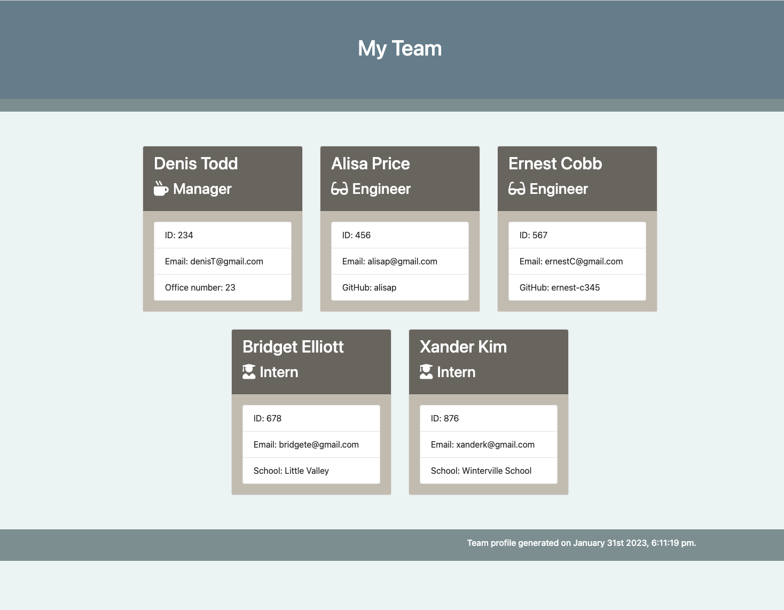

# Team-Profile-Generator

## Description

Command-line application that accepts user input to create an HTML file.

This application will take in information about employees on a software engineering team, then generates an HTML webpage that displays summaries for each person. 

## Screenshot

## Table of Contents   
  - [Description](#description) 
  - [Screenshot](#screenshot) 
  - [Installation](#installation) 
  - [Usage](#usage)
  - [License](#license)
  - [Contributing](#contributing)
  - [Tests](#tests)
  - [Credits](#credits)
  - [Questions](#questions)

##  Installation 

     - No installation required.

##  Usage 

Use  command-line to enter team information. 
First the information about the manager will be asked. Then, when next action is prompt, choose from "Add Engineer" or "Add Intern" to add more members of the team, or "Finish and show profile Team" if you want to finish the input and generate the final HTML file.

##  License 
MIT License   
                        Copyright 2023 sabrina-martorelli   
                        Permission is hereby granted, free of charge, to any person obtaining a copy of this software and associated documentation files (the "Software"), to deal in the Software without restriction, including without limitation the rights to use, copy, modify, merge, publish, distribute, sublicense, and/or sell copies of the Software, and to permit persons to whom the Software is furnished to do so, subject to the following conditions:  
                        The above copyright notice and this permission notice shall be included in all copies or substantial portions of the Software.   
                        THE SOFTWARE IS PROVIDED "AS IS", WITHOUT WARRANTY OF ANY KIND, EXPRESS OR IMPLIED, INCLUDING BUT NOT LIMITED TO THE WARRANTIES OF MERCHANTABILITY, FITNESS FOR A PARTICULAR PURPOSE AND NONINFRINGEMENT. IN NO EVENT SHALL THE AUTHORS OR COPYRIGHT HOLDERS BE LIABLE FOR ANY CLAIM, DAMAGES OR OTHER LIABILITY, WHETHER IN AN ACTION OF CONTRACT, TORT OR OTHERWISE, ARISING FROM, OUT OF OR IN CONNECTION WITH THE SOFTWARE OR THE USE OR OTHER DEALINGS IN THE SOFTWARE.
##  Contributing 
When contributing to this repository, please first discuss the change you wish to make via issue, email, or any other method with the owners of this repository before making a change.
##  Tests 
    - npm test

##  Credits

1. https://www.npmjs.com/package/inquirer- A collection of common interactive command line user interfaces.
2. https://momentjs.com/ -Parse, validate, manipulate,and display dates and times in JavaScript. 
3. https://www.npmjs.com/package/jest - Complete and ready to set-up JavaScript testing solution. Works out of the box for any React project.

##  Questions
 My GitHub profile is [https://github.com/sabrina-martorelli/ ](https://github.com/sabrina-martorelli/). Please follow!

 Additional questions? Please contact me at [sabrina.martorelli@gmail.com ](mailto:sabrina.martorelli@gmail.com).